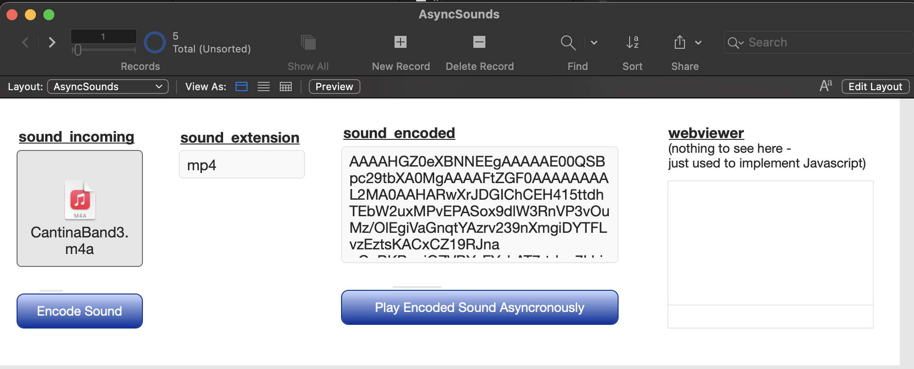

# AsyncSounds

#### A FileMaker Pro Add-On

Play sounds inside FileMaker Pro asynconously. No containers. No UI Controls. Just raw sounds.

#### Points To Ponder

Because these sounds can be played asyncronously, they can overlap each other as well.

3 sound files are included in the Add-on for you to try out.

#### Installation

1. Download "AsyncSounds.fmaddon"

2. Double-click the downloaded file to open FileMaker Pro and it will be automatically installed into the correct directory

3. Open or create the database you wish to add "AsyncSounds" to

4. Create a new, empty "Form" layout

5. In Layout mode, make sure that you have the left side "Objects" pane visible, and click on the "Add-ons" tab

6. Click on the Add "+" button (lower right of pane)

7. Scroll thru the list of possible Add-Ons and select "AsyncSounds" and click "Choose" button

8. Drag newly added Add-On icon over into the layout body

9. Add-On has now been installed, adding the following:
  * 3 new Scripts
  * "AsyncSounds" Table with 3 Records
  * 1 new Layout: "AsyncSounds"

#### Usage

1. create a new, blank record, and drop your sound file into the "incoming" container (on the far left)

2. tap the "Encode" button

3. varify that the extension was correctly calculated (currently supports "wav" & "m4v" files, but if you add more, just adjust the calculation Case statement)

4. play the sound

5. once the sound is encoded, its just text/string data, so the file in the container is no longer needed. This encoded sound data can now just be stored in a variable inside a script if you wish. The Table, Field(s), and Encode script are only needed for this demo file's UI and to create the encoded data.

#### Dependancies

None
